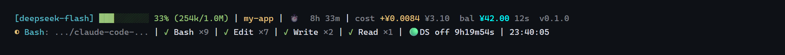

# claude-code-deepseek-statusline

Adds a **DeepSeek** segment to the Claude Code status line: peak/off-peak billing state with a countdown,
the live Beijing clock, the official-rate cost of the session, and your account balance.



```
[deepseek-flash] ███░░░░░░░ 33% (254k/1.0M) | my-app | ⏱️ 8h 33m | cost +¥0.0084 ¥3.10  bal ¥42.00 12s  v0.1.0
◐ Bash: ... | ✓ Edit ×8 | ✓ Bash ×8 | ✓ Write ×2 | ✓ Read ×1 | 🟢DS off 9h20m21s | 23:39:38
```

*(The preview image and the text above are the same render; `docs/preview.zh.png` is the Chinese version.
The cost and balance in them are made-up sample values — see `tools/make-preview.mjs`.)*

The money part sits at the end of the **first** line (next to the session duration) — the delta since the last
refresh, the cumulative session cost, the balance with the age of that reading, and the plugin version. The
peak/off-peak badge and the Beijing clock go at the end of the **last** line, next to the tool activity.

*[中文说明见 README.zh.md](README.zh.md)*

## Why

Two things the existing DeepSeek statusline monitors get wrong, and one they don't show:

1. **Peak hours are invisible.** DeepSeek bills peak and off-peak at a 2× difference, and the windows are
   fixed (Beijing time, weekdays, excluding public holidays). You want to see at a glance whether you are
   currently paying double — and how long it lasts.
2. **The cost figures were wrong.** The rate constants floating around (`¥3 / ¥6 / ¥0.025` per 1M) match no
   official tier, and the usual implementation computes `min(cache_read, input_tokens)` before subtracting —
   but on Claude Code's transcripts `input_tokens` and `cache_read_input_tokens` are *exclusive*, so
   cache-miss input gets counted as zero and the whole session is priced at the cache-hit rate. On a real
   session that under-counts by 2× or more.
3. **Balance, at a glance.** Costs real money, nice to see.

This project prices every assistant message with the official DeepSeek rates using the rate in effect at
*that message's* timestamp, so sessions that cross a switch (or span a weekend) come out right.

## Requirements

- **Node ≥ 18.** The vendored HUD is upstream ESM in `.js` files, so the install directory needs a
  `{"type": "module"}` `package.json` beside it — the installer writes one, and the playbook tells an agent to.
  Without it, older Node resolves those files as CommonJS and the status line renders **nothing at all**, with
  no error visible anywhere (see [INSTALL.md](INSTALL.md#if-nothing-appears)).
- **Claude Code** with a DeepSeek backend — i.e. `ANTHROPIC_BASE_URL=https://api.deepseek.com/anthropic`
  and your DeepSeek key in the `ANTHROPIC_AUTH_TOKEN` env var of `settings.json`
- The balance line needs a **DeepSeek platform key**. It is looked for in many places, in this order:
  `DEEPSEEK_API_KEY` → `ANTHROPIC_AUTH_TOKEN` → `ANTHROPIC_API_KEY`, first in the process environment, then
  in managed settings, `~/.claude/settings.local.json`, `~/.claude/settings.json`, and the project's
  `./.claude/settings{.local,}.json`. Each distinct key found is tried in that order. Everything except the
  balance line works without any key.

  If you reach DeepSeek through a **relay** (your `ANTHROPIC_BASE_URL` is not `api.deepseek.com`), the token
  in `ANTHROPIC_AUTH_TOKEN` is the relay's, and the DeepSeek balance API will reject it with a 401 — no key
  search can fix that. Put a real DeepSeek platform key in `DEEPSEEK_API_KEY`. When the balance cannot be
  shown, the segment says why (`余额 n/a(401)`), and `node scripts/ds.mjs --balance` prints a full diagnosis.

## Install

From a clone:

```sh
git clone https://github.com/yuchigaocen/claude-code-deepseek-statusline
cd claude-code-deepseek-statusline
node install.mjs
```

The installer copies the runtime files to `~/.claude/ds-statusline/`, backs up `settings.json`, and sets
**only** the `statusLine` key. **Your `hooks` are never touched** — unlike some statusline packages, this
one has nothing to say about your hooks.

Two things the installer cannot see — a provider switcher that rebuilds `settings.json`, and the
`package.json` the install directory needs so older Node loads the bundled HUD — are covered in
[INSTALL.md](INSTALL.md) (one page; worth a skim on a machine with either).

It also sets `statusLine.refreshInterval` (default `1`, seconds). That is what makes the countdown and the
clock tick every second; `--refresh-interval 2` halves the CPU cost, `--refresh-interval 0` leaves you with
event-driven refreshes only.

**As a Claude Code plugin** (gives you `/ds-setup`, `/ds-usage`, `/ds-peak`; note that a plugin manifest
*cannot* wire `statusLine` — Claude Code only accepts it from `settings.json` — so `/ds-setup`, which reads
runs the installer and then checks the bar appears, is what actually installs it):

```
/plugin marketplace add yuchigaocen/claude-code-deepseek-statusline
/plugin install ds-statusline@claude-code-deepseek-statusline
/ds-setup
```

### The HUD's own config

The bundled claude-hud reads `~/.claude/plugins/claude-hud/config.json`. The installer copies
[`examples/claude-hud.config.json`](examples/claude-hud.config.json) there **only when that file does not
exist**, so an existing setup is never touched (`--no-config` skips it entirely). Upstream's own defaults are
an expanded layout with no tool line; this default is the compact two-line layout the preview shows.

Knobs worth knowing — all of them live in that file:

| Key | Effect |
| --- | --- |
| `language` | `en` / `zh-Hans` / `zh-Hant`; also switches our segment's labels |
| `lineLayout` | `compact` (two lines) or `expanded` (one element per line) |
| `pathLevels` | how much of the project path to show (`1` = last segment only) |
| `display.modelOverride` | force the model label — the way to drop a suffix like `[1m]`: set it to `deepseek-flash` (update it if you switch models) |
| `gitStatus.enabled` | show the branch / dirty marker on the first line (off in the default) |
| `display.showTools` / `showAgents` / `showTodos` | the activity lines under the header |

### Verify

```sh
node ~/.claude/ds-statusline/scripts/ds.mjs --peak     # peak state, next switch, current rates
node ~/.claude/ds-statusline/scripts/ds.mjs            # full dashboard
node ~/.claude/ds-statusline/scripts/ds.mjs --balance  # read-only key/endpoint/balance check; masks the key
```

The status line itself redraws on the next interaction — no restart needed in most cases. If it does not
appear, restart Claude Code once; if it still does not, [INSTALL.md](INSTALL.md#if-nothing-appears)
lists the verified causes (workspace trust, `disableAllHooks`, Windows path separators) and how to tell them
apart with `claude --debug`.

To try it without touching your real config, point `CLAUDE_CONFIG_DIR` at a scratch directory and run the
installer with `--dest` (POSIX shell shown; in PowerShell set `$env:CLAUDE_CONFIG_DIR` first):

```sh
CLAUDE_CONFIG_DIR=/tmp/scratch node install.mjs && CLAUDE_CONFIG_DIR=/tmp/scratch claude
```

### Uninstall

```sh
node uninstall.mjs            # removes statusLine (only if it points at our install) + the files
node uninstall.mjs --keep-files
```

Both install and uninstall write a timestamped backup next to `settings.json` before touching it.

## What you get

| Command | What it does |
| --- | --- |
| `/ds-setup` | Installs/wires the status line (runs the installer with your consent) |
| `/ds-usage` | Dashboard: balance, session cost with peak/off-peak split, tokens, cache hit rate, current rates |
| `/ds-peak` | Just the peak state, the Beijing clock, and the rate in effect |
| `scripts/ds.mjs --short / --json` | One-liner / machine-readable output (handy for scripts) |
| `scripts/ds.mjs --balance` | **Balance doctor**: effective base URL, every key source (masked), each attempt's HTTP status, backoff, and a concrete fix. Add `--cached` to skip the network probe |

## The cost model

Official CNY rates, per 1M tokens ([source](https://api-docs.deepseek.com/zh-cn/quick_start/pricing)):

| deepseek-flash | peak | off-peak |
| --- | --- | --- |
| cache hit | ¥0.04 | ¥0.02 |
| cache miss | ¥2 | ¥1 |
| output | ¥8 | ¥4 |

`deepseek-v4-pro` is ¥0.30/0.15 · ¥9/4.5 · ¥27/13.5. Off-peak is exactly half of peak.

**Peak hours: 09:00–12:00 and 14:00–18:00 Beijing time, Monday–Friday, excluding Chinese public
holidays.** Everything else is off-peak — including weekends *and* make-up workdays that land on a weekend
(DeepSeek bills by the calendar, not by whether you worked).

The holiday table lives at the top of `scripts/peak-hours.cjs` and currently covers 2026. For a year with
no table, the peak state falls back to weekends-and-hours only and is marked with a `?`. The State Council
publishes next year's schedule each November — add the ranges to `HOLIDAY_RANGES`, run
`node scripts/selfcheck.mjs`, and (if you installed from a clone) re-run `node install.mjs` so the copy in
`~/.claude/ds-statusline/` picks it up.

## How it works

```
scripts/statusline.mjs        entry point: runs the HUD, appends our segment
├── vendor/claude-hud/        upstream claude-hud, vendored unmodified (see vendor/claude-hud/VENDORED.md)
├── scripts/peak-hours.cjs    peak windows, holidays, official rates, cost arithmetic
├── scripts/ds-usage.cjs      transcript scan (official-rate pricing), balance cache
└── scripts/ds.mjs            the CLI behind /ds-usage and /ds-peak
```

Two refresh paths, because Claude Code re-renders the whole status line from a single command and you
cannot give two parts two different triggers:

- **cheap path** (~80 ms, every second): reuse the cached HUD frame, recompute the peak segment and clock
- **full path** (~250 ms, on transcript changes and at most every 30 s): run the HUD, rescan the transcript
  for cost, ask the balance cache to refill

The balance is fetched by a **detached background process** — the status line never waits on the network.
Measured cost of the 1-second default: ~5% of one core idle, ~8–11% while actively editing files. Raise
`refreshInterval` if that bothers you; the segment still works, the seconds just jump.

A failed balance fetch **backs off** rather than retrying forever (6 h on an auth rejection, 30 min on an
unparsable response, 30 s on a network error; no key means no attempt at all). Pasting a corrected key takes
effect immediately, because the backoff is tied to a fingerprint of the key that failed.

The frame is invalidated by the transcript's `size`+`mtime`, the HUD config's `mtime`, the model id and the
context window — deliberately *not* by hashing the whole statusline payload, which contains a
`cost.total_duration_ms` timer that changes every second and would degrade the cache to useless.

Design rationale, failure modes, performance budget and the maintenance checklist live in
**[ARCHITECTURE.md](ARCHITECTURE.md)**.

## Known limits

- **Labels follow the HUD's `language` setting** (`~/.claude/plugins/claude-hud/config.json`), defaulting to
  English. Set `{"language": "zh-Hans"}` for Chinese; `--zh`/`--en` force it per command.
- Anthropic-flavoured usage bars are switched off: DeepSeek has no rate-limit/usage API to fill them, and
  upstream's cost estimate uses Anthropic prices. We show the DeepSeek numbers instead.
- If you use a config manager that rewrites `settings.json` (provider switchers, for instance), it may drop
  the `statusLine` key — typically because it rebuilds that file from its own *common config* plus the active
  provider's profile. Put `statusLine` in the common config, not just in `settings.json`
  ([INSTALL.md](INSTALL.md#two-things-the-installer-cannot-see)); the timestamped backup next to `settings.json` still has
  the value to restore.
- `scripts/ds.mjs` prices the session from Claude Code's transcript. It cannot see traffic that never
  reached a transcript (other tools using the same key), so it is *session* cost, not account spend.

## Credits and license

- The HUD (context bar, git, tools/agents/todos, i18n…) is **[jarrodwatts/claude-hud](https://github.com/jarrodwatts/claude-hud)**
  by Jarrod Watts, MIT, vendored **unmodified** in `vendor/claude-hud/` — that directory keeps its own
  `LICENSE` and a `VENDORED.md` recording the version and commit. Our changes live only in `scripts/`,
  `install.mjs` and `uninstall.mjs`.
- Everything else: MIT © 2026 yuchigaocen. See `LICENSE` and `NOTICE`.
